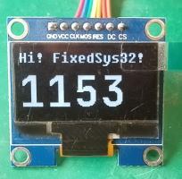

# stm32_blackpill_zephyr_ssd1306_demo




A demo for Zephyr RTOS to shows how to using a custom TTF Font with CFB sub-system to prints text on a small OLED screen.


## Requirements

Set the environment variable `GCC_ARM_HOME` to the directory of your GCC embedded tool-chain or you can change `CMakeLists.txt` directly.

* A STM32F103C8T6 based "Black Pill" or "Blue Pill" development board.
* A small OLED screen with SSD1306 SPI driver.

## Getting Started

```cmd
west build -b stm32_min_dev_black
west flash
```

or 

```cmd
west build -b stm32_min_dev_blue
west flash
```

## Credits

* FixedSys Font: [https://github.com/kika/fixedsys](https://github.com/kika/fixedsys)
* JetBrains Mono Font